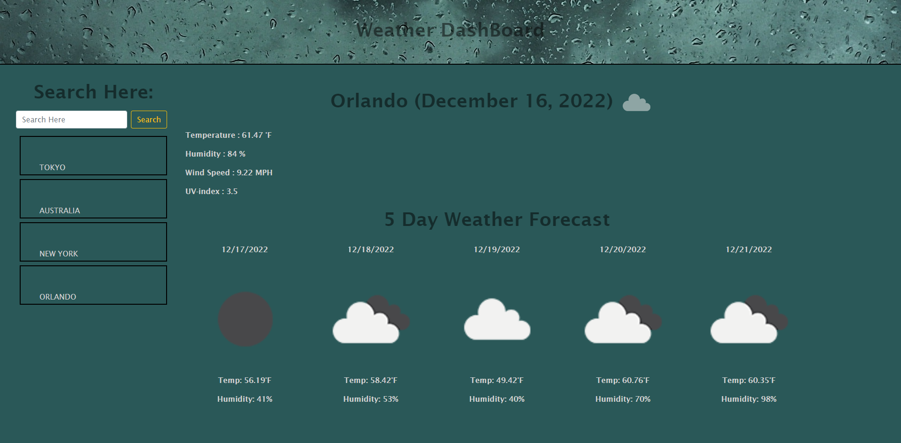

# weather-dashboard-forecast
## Description
<H4>Implemented third party server sided APIs in this project to create a Weather Dashboard.</H4>
<li> I retrieved data from another application's API and applied it towards my own project context.</li>
<li>This weather dashboard will run in the browser and feature dynamically updated HTML and CSS.</li>
<li>Applied acceptance criteria provided.</li>
<li>Created a new repository on my GitHub account and cloned it to computer.</li>
<li>Deployed project using git commands and pushed completed code to my GitHub repository.</li>

## Link To Deployed Project/Application
https://juliennejulien.github.io/weather-dashboard-forecast/
## Visuals

 
 
